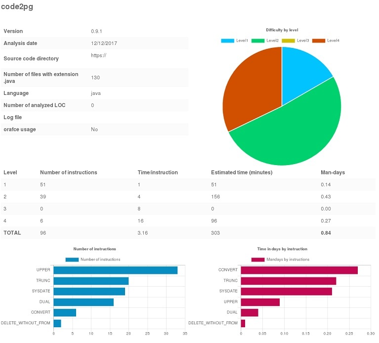

code2pg
=======

What is code2pg ?
-------------

`code2pg` is a tool to help migrate application code from Oracle to PostgreSQL.

It can:
- estimate in man-days how difficult a migration will be for application code (in Java files for example);
- tag the source file for Oracle instructions that might need to be migrated;
- generate different reports: html, text or minimal;
- connect directly to a SVN repository or use local files;
- be tuned according to the team's expertise.

Prerequisites
-------------

`code2pg` is a standalone script. It requires the `File::Slurp` and `Text::ASCIITable` Perl modules.

On a Centos box, it can be installed this way:

```
yum install perl-Text-ASCIITable perl-File-Slurp
```

On a Debian box, the packages could be installed with:

```
apt-get install libtext-asciitable-perl libfile-slurp-perl
```

The script has been tested on Windows with Strawberry Perl and works without extra. A warning is issued though as `wc` is usually not recognized.

Installation
------------

```
git clone https://github.com/societe-generale/code2pg
```

The script should then be made executable:

```
chmod +x code2pg
```

Usage
-----

A few examples:

- show the command line options of the tool:
```
./code2pg --help
```
- analyze java files in the current directory with an extension .java and generate an estimation.html report:
```
./code2pg -e java -l java
```
- analyze plsql files in another directory with extension .properties and generate a named html report. When SQL files must be analyzed directly (such as pl/sql or .properties files), please configure the language as plsql. For other languages, Oracle instructions will be searched between string delimiters.
```
./code2pg -e properties -l plsql -d /tmp/project -o project_estimate.html
```
- analyze java files in a SVN repository and generate a text report:
```
./code2pg -D svn -d https://mysvnrepo/project/trunk -l java -e java -f txt
```

Report examples
---------------

- minimal output:

```
Done !
Estimation: 0.19 man-days
```

- text output:

```
.----------------------------------------------------------------------------------------------------------------.
|                                            code2pg                                                             |
'----------------------------------------------------------------------------------------------------------------'

Version                                  0.9
Analysis date                            05/10/2017
Source code directory                    /home/user/migration-project/
Number of files with extension .properties 13
Language                                 plsql
Number of analyzed LOC                   1826
Log file                                 
orafce usage                             No

.---------------------------------------------------------------------------------------------------------------.
|                             | Number of instructions | Time/instruction | Estimated time (minutes) | Man-days |
+-----------------------------+------------------------+------------------+--------------------------+----------+
| Level 1                     |                     52 |                1 |                       52 |     0.14 |
| Level 2                     |                    106 |                4 |                      424 |     1.18 |
| Level 3                     |                    118 |                8 |                      944 |     2.62 |
| Level 4                     |                      2 |               16 |                       32 |     0.09 |
+-----------------------------+------------------------+------------------+--------------------------+----------+
| Application code estimation |                    278 |             5.22 |                     1452 |     4.03 |
'-----------------------------+------------------------+------------------+--------------------------+----------'

.--------------------------------------.
| Level | Instruction         | Number |
+-------+---------------------+--------+
|     1 | DELETE_WITHOUT_FROM |     17 |
|     1 | DUAL                |      6 |
|     1 | MAX                 |      6 |
|     1 | UPPER               |      2 |
|     1 | USER                |     21 |
+-------+---------------------+--------+
|     2 | COMMIT              |      1 |
|     2 | NVL                 |     28 |
|     2 | ROLLBACK            |      1 |
|     2 | SYSDATE             |      4 |
|     2 | TO_DATE             |     72 |
+-------+---------------------+--------+
|     3 | FIRST               |     26 |
|     3 | LAST                |      5 |
|     3 | TO_CHAR             |     87 |
+-------+---------------------+--------+
|     4 | UID                 |      2 |
'-------+---------------------+--------'
```

- html output: 



How to contribute?
------------------

See [CONTRIBUTING.md](CONTRIBUTING.md)

License
--------
License is under the 2-Clause BSD License.  
See [LICENSE.md](LICENSE.md)
